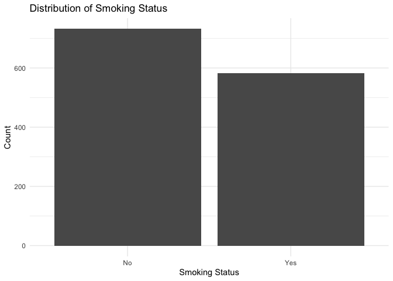

Lab 06 - Ugly charts and Simpson’s paradox
================
Yuxin
2/17/25

### Load packages and data

``` r
library(tidyverse) 
library(dsbox)
library(mosaicData) 
staff <- read_csv("data/instructional-staff.csv")
##Each row in this dataset represents a faculty type, and the columns are the years for which we have data. The values are percentage of hires of that type of faculty for each year.
```

``` r
staff_long <- staff %>%
  pivot_longer(cols = -faculty_type, names_to = "year") %>%
  mutate(value = as.numeric(value))

staff_long
```

    ## # A tibble: 55 × 3
    ##    faculty_type              year  value
    ##    <chr>                     <chr> <dbl>
    ##  1 Full-Time Tenured Faculty 1975   29  
    ##  2 Full-Time Tenured Faculty 1989   27.6
    ##  3 Full-Time Tenured Faculty 1993   25  
    ##  4 Full-Time Tenured Faculty 1995   24.8
    ##  5 Full-Time Tenured Faculty 1999   21.8
    ##  6 Full-Time Tenured Faculty 2001   20.3
    ##  7 Full-Time Tenured Faculty 2003   19.3
    ##  8 Full-Time Tenured Faculty 2005   17.8
    ##  9 Full-Time Tenured Faculty 2007   17.2
    ## 10 Full-Time Tenured Faculty 2009   16.8
    ## # ℹ 45 more rows

``` r
staff_long %>%
  ggplot(aes(x = year, y = value, color = faculty_type)) +
  geom_line()
```

    ## `geom_line()`: Each group consists of only one observation.
    ## ℹ Do you need to adjust the group aesthetic?

<!-- -->

``` r
## `geom_line()`: Each group consists of only one observation.
## ℹ Do you need to adjust the group aesthetic?
## To address this, we can use the group aesthetic in the following code.
```

### Exercise 1

``` r
staff_long %>%
  ggplot(aes(
    x = year,
    y = value,
    group = faculty_type,
    color = faculty_type
  )) +
  geom_line() + labs (
    title = "Faculty Trends Over Time", x = "Year", y = "Percentage of Hires") +   theme_minimal()
```

<!-- -->

### Exercise 2

``` r
## Suppose the objective of this plot was to show that the proportion of part-time faculty have gone up over time compared to other instructional staff types.
## the goal is to compare proportions, we should normalize the data so that each year sums to 100%.
staff_long <- staff_long %>%
  group_by(year) %>%
  mutate(proportion = value / sum(value))

staff_long %>%
  group_by(faculty_type) %>%
  ggplot(aes(
    x = year,
    y = proportion,
    fill = faculty_type))+
    geom_bar(stat = "identity", position = "fill")+
    labs(
    title = "Proportion of Part-Time Faculty Over Time",
    x = "Year",
    y = "Proportion of Faculty",
    fill = "Faculty Type"
    ) +
    coord_flip()+
    theme_minimal()
```

<!-- -->

### Exercise 3

``` r
fisheries <- read_csv("data/fisheries.csv")
```

    ## Rows: 216 Columns: 4
    ## ── Column specification ────────────────────────────────────────────────────────
    ## Delimiter: ","
    ## chr (1): country
    ## dbl (3): capture, aquaculture, total
    ## 
    ## ℹ Use `spec()` to retrieve the full column specification for this data.
    ## ℹ Specify the column types or set `show_col_types = FALSE` to quiet this message.

``` r
#(1) in the pie chart, there are too many small categories、 
#(2) the color is ugly...
#(3) Combining all countries into one chart makes it messy. only select the top 10 countries to compare would be more clear 


fisheries_long <- fisheries %>%
  pivot_longer(cols = c("capture", "aquaculture"), names_to = "type", values_to = "value")

top_10 <- fisheries %>%
  arrange(desc(total)) %>%
  slice(1:10)


top_10 <- top_10 %>%
  mutate(percentage_aquaculture = aquaculture / sum(aquaculture) * 100)

  
ggplot(top_10, aes(x = "", y = aquaculture, fill = country)) +
  geom_bar(stat = "identity", width = 1) +
  coord_polar("y", start = 0) +  # Convert to pie chart
  labs(
    title = "Aquaculture - Top 10 Countries",
    fill = "Country"
  ) +
  theme_minimal() +
  theme(axis.text = element_blank(), axis.ticks = element_blank())
```

<!-- -->

\##Stretch Practice with Smokers in Whickham

library(tidyverse) library(mosaicData) data(Whickham) ?Whickham \##A
data frame with 1314 observations on women for the following variables.

### Exercises

###### (1) the data come from an observational study. becuase the experimenter did not manipulate variables (e.g., assigning participants to smoking vs. non-smoking conditions)

###### (2) The dataset contains 1,314 observations. Each observation represents an individual woman who was part of the study.Each row corresponds to a single participant and includes: her survival status after 20 years (Alive or Dead); her smoking status at baseline (Yes or No); her age at the time of the first survey.

\##(3)

``` r
library(ggplot2)
library(dplyr)
##three variables: outcome, smoker, and age.

##Outcome (Categorical)
ggplot(Whickham, aes(x = outcome)) +
  geom_bar() +
  labs(title = "Distribution of Survival Status", x = "Survival Status", y = "Count") +
  theme_minimal()
```

<!-- -->

``` r
##Smoker (Categorical)
ggplot(Whickham, aes(x = smoker)) +
  geom_bar() +
  labs(title = "Distribution of Smoking Status", x = "Smoking Status", y = "Count") +
  theme_minimal()
```

<!-- -->

``` r
##Age (Continuous)
ggplot(Whickham, aes(x = age)) +
  geom_density(fill = "blue", alpha = 0.3) +
  labs(title = "Age Density Plot", x = "Age (years)", y = "Density") +
  theme_minimal()
```

<!-- --> \## (4) What
would you expect the relationship between smoking status and health
outcome to be? \##I would expect that smokers have a higher likelihood
of being in the “Dead” category after 20 years compared to non-smokers.

## (5)

``` r
Whickham %>%
  count(smoker, outcome) %>%
  group_by(smoker) %>%
  mutate(proportion = n / sum(n))
```

    ## # A tibble: 4 × 4
    ## # Groups:   smoker [2]
    ##   smoker outcome     n proportion
    ##   <fct>  <fct>   <int>      <dbl>
    ## 1 No     Alive     502      0.686
    ## 2 No     Dead      230      0.314
    ## 3 Yes    Alive     443      0.761
    ## 4 Yes    Dead      139      0.239

``` r
ggplot(Whickham, aes(x = smoker, fill = outcome)) +
  geom_bar(position = "fill") +  #Normalizes the bar heights
  labs(title = "Survival Proportion by Smoking Status",
       x = "Smoking Status",
       y = "Proportion",
       fill = "Outcome") +
  theme_minimal()
```

<!-- -->

``` r
## the proportion of Alive individuals is higher among smokers (76.1%) compared to non-smokers (68.6%).
## The proportion of Dead individuals is lower among smokers (23.9%) than non-smokers (31.4%).
## it did not meet my expectation. 
```

## (6)

``` r
Whickham <- Whickham %>%
  mutate(age_cat = case_when(
    age <= 44 ~ "18-44",
    age > 44 & age <= 64 ~ "45-64",
    age > 64 ~ "65+"
  ))
```

## (7)

``` r
##Re-create the visualization depicting the relationship between smoking status and health outcome, faceted by age_cat
##Extend the contingency table from earlier by breaking it down by age category and use it to help your narrative. We can use the contingency table to examine how the relationship between smoking status and health outcome differs between different age groups. This extension will help us better understand the patterns we see in the visualization, and explain any changes we observe.

Whickham %>%
  count(smoker, age_cat, outcome)
```

    ##    smoker age_cat outcome   n
    ## 1      No   18-44   Alive 327
    ## 2      No   18-44    Dead  12
    ## 3      No   45-64   Alive 147
    ## 4      No   45-64    Dead  53
    ## 5      No     65+   Alive  28
    ## 6      No     65+    Dead 165
    ## 7     Yes   18-44   Alive 270
    ## 8     Yes   18-44    Dead  15
    ## 9     Yes   45-64   Alive 167
    ## 10    Yes   45-64    Dead  80
    ## 11    Yes     65+   Alive   6
    ## 12    Yes     65+    Dead  44

``` r
ggplot(Whickham, aes(x = smoker, fill = outcome)) +
  geom_bar(position = "fill") + 
  facet_wrap(~ age_cat) +        # Facet by age category
  labs(title = "Proportion of Survival by Smoking Status Across Age Groups",
       x = "Smoking Status", y = "Proportion",
       fill = "Outcome") +
  theme_minimal()
```

<!-- -->

``` r
## The proportion of "Dead" is larger in the "Yes" (smoker) group compared to the "No" (non-smoker) group, particularly in the older age groups.
```
